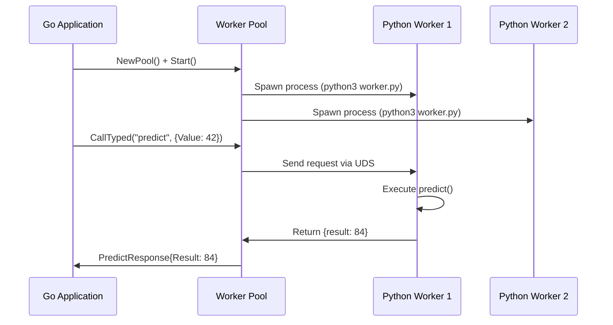

# Quick Start

Get pyproc running in **5 minutes** with this step-by-step guide.

## Prerequisites

Before you begin, ensure you have:

- **Go 1.22+** installed
- **Python 3.9+** installed (Python 3.12 recommended)
- **Unix-based OS** (Linux or macOS)

## Step 1: Install Dependencies

### Go Side

Add pyproc to your Go project:

```bash
go get github.com/YuminosukeSato/pyproc@latest
```

### Python Side

Install the Python worker package:

```bash
pip install pyproc-worker
```

???+ tip "Using a Virtual Environment"
    We recommend using a Python virtual environment:

    ```bash
    python3 -m venv venv
    source venv/bin/activate  # On Windows: venv\Scripts\activate
    pip install pyproc-worker
    ```

## Step 2: Create a Python Worker

Create a file named `worker.py`:

```python title="worker.py"
from pyproc_worker import expose, run_worker

@expose
def predict(req):
    """
    Simple prediction function.

    Args:
        req: Dictionary with 'value' key

    Returns:
        Dictionary with 'result' key
    """
    value = req.get("value", 0)
    result = value * 2

    return {
        "result": result,
        "model": "simple-multiplier",
        "confidence": 0.99
    }

if __name__ == "__main__":
    run_worker()
```

### How It Works

- **`@expose` decorator**: Registers the function to be callable from Go
- **Input**: Receives a Python dictionary (`req`)
- **Output**: Returns a Python dictionary (automatically JSON-serialized)
- **`run_worker()`**: Starts the worker and listens on Unix Domain Socket

## Step 3: Call from Go

Create a file named `main.go`:

```go title="main.go"
package main

import (
    "context"
    "fmt"
    "log"
    "github.com/YuminosukeSato/pyproc/pkg/pyproc"
)

// Define request/response types for compile-time type safety
type PredictRequest struct {
    Value float64 `json:"value"`
}

type PredictResponse struct {
    Result     float64 `json:"result"`
    Model      string  `json:"model"`
    Confidence float64 `json:"confidence"`
}

func main() {
    // Create a pool of Python workers
    pool, err := pyproc.NewPool(pyproc.PoolOptions{
        Config: pyproc.PoolConfig{
            Workers:     4,  // Run 4 Python processes
            MaxInFlight: 10, // Max concurrent requests per worker
        },
        WorkerConfig: pyproc.WorkerConfig{
            SocketPath:   "/tmp/pyproc.sock",
            PythonExec:   "python3",
            WorkerScript: "worker.py",
        },
    }, nil)
    if err != nil {
        log.Fatal(err)
    }

    // Start all workers
    ctx := context.Background()
    if err := pool.Start(ctx); err != nil {
        log.Fatal(err)
    }
    defer pool.Shutdown(ctx)

    // Call Python function with type safety
    result, err := pyproc.CallTyped[PredictRequest, PredictResponse](
        ctx, pool, "predict", PredictRequest{Value: 42},
    )
    if err != nil {
        log.Fatal(err)
    }

    fmt.Printf("Result: %.0f\n", result.Result)              // Result: 84
    fmt.Printf("Model: %s\n", result.Model)                  // Model: simple-multiplier
    fmt.Printf("Confidence: %.2f\n", result.Confidence)      // Confidence: 0.99
}
```

### Configuration Explained

| Parameter | Description |
|-----------|-------------|
| `Workers` | Number of Python processes to spawn (recommended: 2-8 per CPU core) |
| `MaxInFlight` | Max concurrent requests per worker (prevents overload) |
| `SocketPath` | Unix Domain Socket file path (must be writable) |
| `PythonExec` | Python interpreter path (`python3`, or path to venv) |
| `WorkerScript` | Path to your Python worker script |

## Step 4: Run

Initialize Go modules (if needed):

```bash
go mod init example
go mod tidy
```

Run your Go application:

```bash
go run main.go
```

**Expected Output:**

```
Result: 84
Model: simple-multiplier
Confidence: 0.99
```

✅ **Success!** You've successfully called Python from Go using pyproc.

## What Just Happened?

Here's the complete flow:



1. **Pool Creation**: Go spawns 4 Python worker processes
2. **Socket Connection**: Each worker connects via Unix Domain Socket
3. **Load Balancing**: Pool distributes requests round-robin
4. **Type Safety**: Go generics ensure compile-time type checking
5. **JSON Serialization**: Automatic conversion between Go structs and Python dicts

## Next Steps

Now that you have pyproc running, explore more advanced features:

<div class="grid cards" markdown>

-   :material-shield-check:{ .lg .middle } **Type-Safe API**

    ---

    Learn how to use compile-time type checking for safer code

    [:octicons-arrow-right-24: Type Safety Guide](../guides/type-safe-api.md)

-   :material-hammer-wrench:{ .lg .middle } **Worker Development**

    ---

    Build production-ready Python workers with error handling

    [:octicons-arrow-right-24: Worker Guide](../guides/worker-development.md)

-   :material-speedometer:{ .lg .middle } **Performance Tuning**

    ---

    Optimize for low latency and high throughput

    [:octicons-arrow-right-24: Performance Guide](../guides/performance-tuning.md)

-   :material-alert-circle:{ .lg .middle } **Error Handling**

    ---

    Handle errors gracefully and implement retry logic

    [:octicons-arrow-right-24: Error Handling](../guides/error-handling.md)

</div>

---

## Try the Demo Repository

If you cloned the [pyproc repository](https://github.com/YuminosukeSato/pyproc), you can run a working example:

```bash
make demo
```

This runs the example in `examples/basic/` with pre-configured worker paths.

## Troubleshooting

### Worker fails to start

**Symptom**: `failed to start worker` error

**Solutions**:

1. Check Python is accessible:
   ```bash
   python3 --version
   ```

2. Verify worker script exists:
   ```bash
   ls -la worker.py
   ```

3. Test worker manually:
   ```bash
   python3 worker.py
   # Should not error immediately
   ```

### Socket permission errors

**Symptom**: `permission denied` when connecting to socket

**Solutions**:

1. Ensure socket directory is writable:
   ```bash
   mkdir -p /tmp
   chmod 755 /tmp
   ```

2. Remove stale socket files:
   ```bash
   rm -f /tmp/pyproc.sock*
   ```

### Import errors in Python

**Symptom**: `ModuleNotFoundError: No module named 'pyproc_worker'`

**Solutions**:

1. Verify installation:
   ```bash
   pip list | grep pyproc-worker
   ```

2. Reinstall if needed:
   ```bash
   pip install --upgrade pyproc-worker
   ```

For more troubleshooting, see the [Troubleshooting Guide](../deployment/troubleshooting.md).
