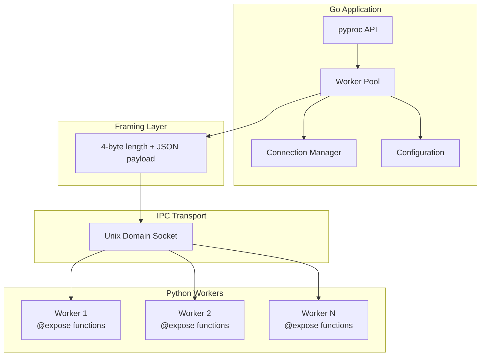
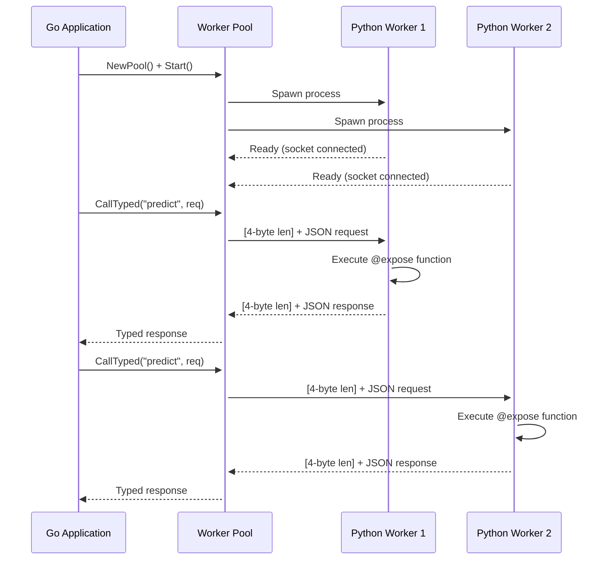
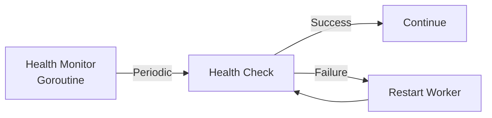
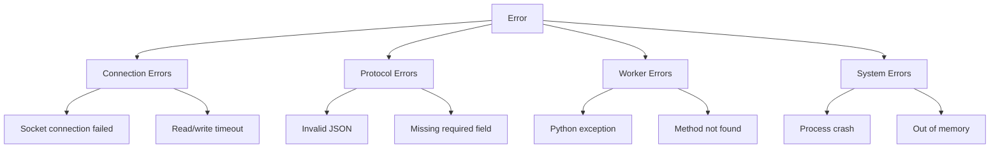

# Architecture

Technical design and implementation details of pyproc.

## Overview

pyproc is a Go library that enables calling Python functions from Go without CGO or microservices. It uses Unix Domain Sockets (UDS) for low-latency inter-process communication and prefork workers to bypass Python's Global Interpreter Lock (GIL).

### Goals

- **Run Python on the same host as Go** — without CGO complexity
- **Maintain failure isolation** — separate Python process boundaries
- **Provide predictable IPC** — small, well-defined protocol over Unix Domain Sockets
- **Scale Python execution** — bypass GIL through multiple processes
- **Offer simple API** — function-like interface for Go developers

---

## System Architecture

### High-Level Components



### Message Flow



1. **Pool Creation**: Go spawns N Python worker processes
2. **Socket Connection**: Each worker connects via Unix Domain Socket
3. **Load Balancing**: Pool distributes requests round-robin
4. **Request Framing**: 4-byte length header + JSON payload
5. **Function Execution**: Python worker runs `@expose` decorated function
6. **Response**: JSON result framed and sent back to Go
7. **Type Safety**: Go generics deserialize to typed struct

---

## Worker Pool Design

### Load Balancing Strategy

The pool implements **round-robin** load balancing for fair work distribution:

```go
// Atomic counter for worker selection
idx := p.nextIdx.Add(1) - 1
worker := p.workers[idx % uint64(len(p.workers))]
```

**Why Round-Robin?**

- ✅ Simple and predictable
- ✅ Fair distribution for homogeneous workloads
- ✅ Low overhead (atomic counter)
- ⚠️ Does not consider worker load

**Future**: Consider weighted load balancing based on worker metrics.

### Backpressure Mechanism

Prevents overwhelming workers using a **global semaphore + per-worker gate** approach:

```go
// Limit total in-flight requests across the pool
semaphore := make(chan struct{}, maxInFlight)
// Limit per-worker in-flight requests
inflightGate := make(chan struct{}, maxInFlightPerWorker)

// Before each request
semaphore <- struct{}{}  // Blocks if limit reached
defer func() { <-semaphore }()  // Release after completion
```

**Configuration**:
```go
Config: pyproc.PoolConfig{
    Workers:               4,   // 4 Python processes
    MaxInFlight:           10,  // Max concurrent requests across the pool
    MaxInFlightPerWorker:  1,   // Max in-flight per worker
    // Effective capacity: min(10, 4*1) = 4 concurrent requests
}
```

### Health Monitoring



**Health Check Steps**:
1. Send `health` method request to worker
2. Verify socket is still connected
3. Check process liveness (PID exists)
4. If any fail, trigger restart with exponential backoff

**Configuration**:
```go
Config: pyproc.PoolConfig{
    HealthInterval: 30 * time.Second,  // Check every 30s
    Restart: RestartConfig{
        Enabled:     true,
        MaxRetries:  3,
        BackoffBase: 1 * time.Second,
    },
}
```

---

## Protocol Specification

### Framing Protocol

Every message (request and response) is framed with a 4-byte big-endian length header:

```
┌────────────┬─────────────────────────────────┐
│  4 bytes   │         N bytes                 │
│ (uint32)   │                                 │
│  length    │      JSON payload               │
└────────────┴─────────────────────────────────┘
```

**Example**:
```
[0x00, 0x00, 0x00, 0x2A, '{', '"', 'i', 'd', '"', ':', '1', ...]
│                        │
└─ Length: 42 bytes ────┘
```

### Request Format

```json
{
  "id": 12345,         // Unique request ID (uint64)
  "method": "predict", // Python function name
  "body": {            // Function arguments (any JSON object)
    "value": 42,
    "features": [1.0, 2.0, 3.0]
  }
}
```

**Fields**:
- `id` (required): Unique request identifier for matching responses
- `method` (required): Name of Python function decorated with `@expose`
- `body` (optional): Arguments passed to Python function (defaults to `{}`)

### Response Format

#### Success Response

```json
{
  "id": 12345,   // Matches request ID
  "ok": true,    // Success indicator
  "body": {      // Function return value
    "result": 84.0,
    "confidence": 0.99
  }
}
```

#### Error Response

```json
{
  "id": 12345,
  "ok": false,
  "error": "Method not found: unknown_method"
}
```

**Error Types**:
- `Method not found`: Function not exposed with `@expose`
- `Invalid JSON`: Malformed request body
- `Python exception`: Unhandled error in Python function

---

## Reliability Features

### Process Supervision

```go
// Worker monitors child Python process
go func() {
    for {
        select {
        case <-ctx.Done():
            return
        case <-time.After(healthInterval):
            if !w.isHealthy() {
                w.restart()
            }
        }
    }
}()
```

**Features**:
- Automatic restart on crashes
- Exponential backoff for repeated failures
- Socket cleanup on restarts
- Process zombie reaping

### Connection Pooling

Each worker maintains a persistent connection:

```go
// Reuse connection across requests
conn := worker.connection
framer := framing.NewFramer(conn)

// Send request
framer.WriteMessage(reqData)

// Read response
respData, err := framer.ReadMessage()
```

**Benefits**:
- No socket open/close overhead per request
- Connection reuse reduces latency
- Backpressure via MaxInFlight (global) + MaxInFlightPerWorker (per worker)

### Graceful Shutdown

```go
pool.Shutdown(ctx)
```

**Shutdown Steps**:
1. Stop accepting new requests
2. Wait for in-flight requests to complete (with timeout)
3. Send termination signal to workers
4. Close all socket connections
5. Remove socket files from filesystem

---

## Performance Optimizations

### Current Optimizations

| Optimization | Benefit | Implementation |
|-------------|---------|----------------|
| **Connection Reuse** | Reduce socket open/close overhead | Persistent connections per worker |
| **Process Prefork** | Avoid startup cost per request | Workers start once, handle many requests |
| **Parallel Processing** | Bypass Python GIL | Multiple Python processes |
| **Buffer Management** | Reduce allocations | Efficient buffer pooling |
| **Zero-Copy Framing** | Reduce memory copying | Direct buffer writes |

### Benchmarked Performance

**Test Environment**: M1 MacBook Pro, Go 1.22, Python 3.12

| Workers | Latency (p50) | Latency (p99) | Throughput |
|---------|---------------|---------------|------------|
| 1       | 235μs         | ~500μs        | 4,255 req/s |
| 2       | 124μs         | ~300μs        | 8,065 req/s |
| 4       | 68μs          | ~200μs        | 14,706 req/s |
| 8       | 45μs          | 125μs         | 22,222 req/s |

**Parallel Benchmark** (concurrent load):
- 8 workers: **5μs p50**, **200,000+ req/s**

See [Performance Tuning Guide](../guides/performance-tuning.md) for optimization techniques.

---

## Extensibility

### Protocol Flexibility

pyproc decouples framing and payload encoding:

```go
type Codec interface {
    Encode(v interface{}) ([]byte, error)
    Decode(data []byte, v interface{}) error
}

// Current: JSON codec
codec := codec.NewJSONCodec()

// Future: MessagePack, Protobuf, Arrow
codec := codec.NewMsgpackCodec()
```

### Planned Protocol Support

| Protocol | Version | Status | Use Case |
|----------|---------|--------|----------|
| **JSON** | v0.1 | ✅ Implemented | Human-readable, general-purpose |
| **MessagePack** | v0.2 | 🚧 Planned | Binary serialization, smaller payloads |
| **gRPC** | v0.4 | 📋 Roadmap | Industry-standard RPC |
| **Arrow IPC** | v0.5 | 📋 Roadmap | Zero-copy for large datasets |

---

## Key Design Decisions

### Why Unix Domain Sockets?

**Pros**:
- **Lower latency** — No network stack overhead (~2μs vs ~6μs for TCP loopback)
- **Better security** — Filesystem permissions control access
- **No port management** — No port conflicts or discovery
- **Ideal for same-host** — Perfect for containerized deployments

**Cons**:
- **Limited to same host** — Cannot communicate across network
- **Platform-specific** — Unix-like systems only (Linux, macOS)

**Alternatives Considered**:
- TCP loopback: Higher latency (~3x slower)
- Named pipes: Windows-specific
- Shared memory: Complex synchronization

### Why Process-based Parallelism?

**Pros**:
- **Complete GIL bypass** — Each process has independent GIL
- **True parallel execution** — Utilize all CPU cores
- **Process isolation** — Crashes don't affect other workers
- **Better multi-core utilization** — Linear scaling up to CPU cores

**Cons**:
- **Higher memory usage** — Each process loads Python interpreter
- **Process startup overhead** — Mitigated by prefork
- **IPC complexity** — Solved by pyproc abstraction

**Alternatives Considered**:
- Python threading: Limited by GIL
- Python asyncio: Still single-threaded
- Embedded Python (CGO): GIL bottleneck, crash propagation

### Why JSON Protocol?

**Pros**:
- **Human-readable** — Easy debugging with logs
- **Native support** — Built-in Go `encoding/json` and Python `json`
- **Flexible schema** — Easy evolution without breaking changes
- **Wide ecosystem** — Tools, libraries, documentation

**Cons**:
- **Serialization overhead** — ~5μs per request
- **Larger message sizes** — ~2-3x compared to binary formats
- **Type conversion** — String → number conversions

**Future**: MessagePack for performance-critical workloads.

---

## Error Handling Strategy

### Error Categories



### Recovery Mechanisms

| Error Type | Recovery Strategy | Implementation |
|-----------|------------------|----------------|
| **Connection Error** | Retry with exponential backoff | Auto-retry up to 3 times |
| **Protocol Error** | Return error to caller | No retry (fix payload) |
| **Worker Crash** | Restart worker process | Exponential backoff restart |
| **System Error** | Graceful degradation | Circuit breaker pattern |

**Example**:
```go
result, err := pool.Call(ctx, "predict", req)
if err != nil {
    // Check error type
    if errors.Is(err, ErrWorkerUnavailable) {
        // Retry with backoff
    } else if errors.Is(err, ErrInvalidRequest) {
        // Log and return error (no retry)
    }
}
```

See [Error Handling Guide](../guides/error-handling.md) for patterns.

---

## Security Considerations

- **Unix socket permissions** — Filesystem ACL for access control
- **Process isolation** — Python crashes contained
- **No network exposure** — Local-only by default
- **Input validation** — Python workers validate requests

⚠️ **pyproc is NOT a sandbox** — Python code can access filesystem and network.

See [Security Reference](security.md) for detailed threat model.

---

## Related Documentation

- **[Operations Guide](operations.md)**: Deployment and monitoring
- **[Security Guide](security.md)**: Security model and best practices
- **[Codec Performance](codec-performance.md)**: Serialization benchmarks
- **[Performance Tuning](../guides/performance-tuning.md)**: Optimization techniques

---

## Contributing to Architecture

See [Contributing Guide](../community/contributing.md) for how to propose architectural changes.

Architecture proposals should include:
- Problem statement
- Alternatives considered
- Performance impact analysis
- Breaking change assessment
